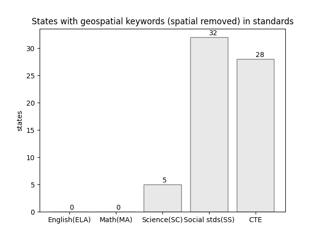
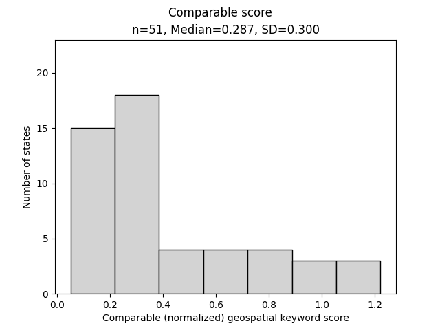

# Overview

### BACKGROUND
This research uses iterative machine analyses to search for, record, and analyze
the presence of select geospatial keywords in US K12 curriculum standards, frameworks,
and programs of study. The state curriculum standards in English language arts (ELA), mathematics (MA), science (SC), social studies (SS), and Career Technical Education (CTE) as defined by each state, are accessed in their most recent version, decrypted, and saved to an archive prior to the machine analyses.

A modern, high-level programming language, Python 3.x was used to search the 3,500+ standards documents included in the study. The library PyPDF2 was used for reading documents. MySQL database was used to hold the retrieved data and samples. Python was also used to generate Markdown and HTML web pages based on content logged to the database. Python libraries Matplotlib and Numpy are used to generate the charts and graphcs.
The technical architecture used in this project is flexible, allowing for standards documents to be added or removed.  With the click of a few buttons all standards documents can be rescanned, committed to the database, analyzed, and published.  As multiple states update one or more standards documents annually, this capacity to completely recreate the analyses and reports is critical.  The algorithms and code are also flexible in that keywords may be added or removed.  Even geographical entities (e.g. US territories) could relatively easily added to the reporting.

##### Reading documents
For this study, over 3,500 standards documents where obtained from states' departments of education.  Documents were either downloaded in or converted to the portable document format (PDF) standard. Documents were both searched for keywords and total words were counted. Word counts look for runs of letters, separated by a space. This generally works well, although tables can be problematic. Extensive footers throughout a document can skew the practical total word count. Finally, the identifiers used in standards (e.g. C.1.234f) can be counted as one or more words, depending on how the indicator string is written.  Total word count is important as it becomes the denominator in determing a state's comparable score.

Documents archived include:
- Core, Content, or Performance tandards
- Frameworks
- Course or programs of study (CTE)
- Assessment blueprints (CTE)

Documents not included:
- Progressions
- Introductions (unless a part of an above document)
- “placemat” standards (unless no other standards documents were found)

The majority of documents used in CTE are course or program of study descriptions, while the core academic disciplines use content standards. By and large, social studies standards vary more greatly (in content and form) from state to state than the other three academic areas.

Standards documents were either downloaded in a PDF (format) or converted to PDF. There were cases where PDFs needed to be encoded without binary objects (like images), allowing for the PDF to be readable by the machine. These PDFs are included in the file archive. Most of these updated PDFs are not easy for humans to read, but are far more machine readable than the originals. 

For purposes of reproducibility, the MacIntosh worflow for PDF conversion: 1. Adobe Acrobat > File: Export to: Rich Text Format 2. TextEdit > Print : PDF : Save as PDF.

### FINDINGS
Fifty states' (and one district's) findings are generated and posted on this site, https://trbaker.github.com/GIStandards  These state reports each contain:
-	Total geospatial keywords found in five standards areas
-	A “comparable score” (basically the total geospatial keywords divided by all words in the standards)
-	A count of geospatial keywords (and comparable scores) by subject area
-	Link to the digital archive of the machine-readable standards
-	A reference to the document, page, and character position where keywords were found.  The keyword is also presented with a fixed number of words before and after it to provide context.

Each of five subject areas use the selected geospatial keywords in multiple states – ranging from approximately two dozen states with geospatial language in science standards to nearly four dozen states with geospatial language in the social studies standards.  Geospatial keywords were surprisingly robust in both math and English (ELA) although the vast majority can be attributed to the use of the word, “spatial”.

The keyword "spatial" accounts for about 50% of all keywords found.  While "spatial" is a general term, often used interchangeably with locational or geographical, it alone does not rise to the level of specificity of "geospatial", "GIS", or even "geographic analysis".  Use in various standards, "spatial" is often used with "temporal" (especially in science) to underscore the relevance of time and space in data.  For these reasons, it's worth reconsidering figure 1 with "spatial" removed from findings.

Figure 2 shows that "spatial" is the only geospatial keyword in most English (ELA) and mathematics (MA) standards.  In science, the Next Generation Science Standards (NGSS) refer to "spatial and temporal".  The shift from figure 1 to figure 2 in science indicates in large part, the number of states using the NGSS. The change in social studies was the real surprise, moving from 46 to 31 states - or about a 35% decline in states when "spatial" was removed from the geospatial keyword list.  Califnornia is one such example where "spatial thinking", "spatial contexts", and "spatial distribution" are present in the social studies standards but there is no geospatial language or technology in those standards.  It's a cautionary tale.

When plotting data on a histogram, it is apparent the total raw count of geospatial keywords by state is non-normal, producing a histogram that is right-skewed. Due to the skewedness of the distribution, the median rather than the mean is provided.

In an attempt to normalize the raw counts of geospatial keywords, keyword counts are divided by total words in those standards (called a comparable score). 

Consider the common case where state A uses 40,000 words in its K-12 science standards, but state B uses 400,000 words.  The machine counts the occurrence of each keyword in the same way.  By normalizing the machine’s count (dividing by total words in the standards), we might improve the values for state-by-state comparison purposes.  

The downside to this effort is that the organization of standards (especially in CTE) can force the denominator in this simple equation to swing wildly: Ultimately giving small standards (or impossible to find standards) an unfair advantage.  It is therefore the researcher's conclusion that the reader really should consider both scores as a way of mitigating extremes. This is not a perfect solution, but a better one.

 
While this distribution is also right-skewed, the standard deviation (and range) of the dataset is much tighter.  Figure 5 shows a state list, ordered by comparative scores where states with a higher score have a higher ratio of geospatial keywords to document size.  For most states, comparative scores increase
when there is an identified geosaptial program in CTE (e.g. Maryland, Michigan, Kansas, Alabama) or the state's academic standards make an exceptional effort to incorporate geospatial language. For example:
- Social studies: Minnesota, Vermont, Colorado, Idaho, Indiana
- Science: West Virginia
- Math: Wyoming

For educators who must align their activities and lessons to state standards, it's clear that only in rare cases do standards support teaching about geospatial technologies for any discernable amount of time.  There are noticeable exceptions, likely entirely within state CTE standards, where a course or program of study is actually about geospatial technologies.  However, it's clear that throughout social studies and science standards, spatial contexts and relationships are critical components of understanding other phenomena.  It is largely for these reasons, the savvy curriculum developer uses geospatial tools to teach other standards-based content, rather than developing instructional activities that teach the so-called "mechanics" of any given geospatial tool.

Examining comparable scores by state on a map does not seem to suggest a regional cluster of states with exceptional use of geospatial language. One interesting facet of the map is the use of "Natural Breaks" to organize data into groups and to represent those groups with color.  In this way, the number of states in each group are not the same, but importantly, each color represents a cohort of states with similar comparable scores.  With this map, the innovators pop out in dark red while the laggards wash out into a pale white.

<small><a href="//education.maps.arcgis.com/apps/Embed/index.html?webmap=3356153e4cc542f7acb8d7bcedc8cce9&extent=-180,1.4428,59.1833,71.3688&zoom=true&scale=false&legend=true&disable_scroll=true&theme=light" style="color:#0000FF;text-align:left" target="_blank">View larger map</a></small> <iframe width="500" height="400" frameborder="0" scrolling="no" marginheight="0" marginwidth="0" title="GIS in K12 Standards (GIStandards)" src="//education.maps.arcgis.com/apps/Embed/index.html?webmap=3356153e4cc542f7acb8d7bcedc8cce9&extent=-180,1.4428,59.1833,71.3688&zoom=true&previewImage=false&scale=false&legend=true&disable_scroll=true&theme=light"></iframe>

If [map above doesn't display, click here](https://education.maps.arcgis.com/home/webmap/viewer.html?webmap=3356153e4cc542f7acb8d7bcedc8cce9)

 
 Further examing the geospatial language in standards through the lens of Rogers' Diffusion of Innovation, we can see the following break down by state comparable scores.
 
 - Innovators (top 2.5% = 1 state):
 - Early Adopters (13.5% = 7)
 - Early majority (34% = 17)
 - Late majority (34% = 17)
 - Laggards (16% = 9 )
 
### CONCLUSIONS
Aside from state curriculum standards, in the US, national subject area standards (along with cross-cutting standards like ISTE's technology standards) and district or local standards may all inform classroom activities to varying levels.  Assessments tied to standards, administrative oversight, and external factors (e.g. COVID-19) also all play roles on the impact of standards in classroom activites. Regardless, this research should help inform curriculum developers, educators, and researchers about the condition of geospatial language used in state standards - in part providing a way to view and measure the importance of geospatial tools in curriculum and society as gauged by the larger K-12 community.

### BIBLIOGRAPHY

Jo, I., Duke, B. & Baker, T.R. (2019). Advance Your Geospatial Technology--Empowered by Your Curriculum Standards. NCSS 2019 Conference: Austin, TX. http://bit.ly/geospatialwords 

Milson, A.J. & Roberts, J.A. (2008). The status of geospatial technologies in state geography standards in the United States. In Milson, A.J. & Alibrandi, M., *Digital geography: Geospatial technologies in the social studies classroom* (pp. 39-59). Charlotte, NC: Information Age Publishing.

US Census. (2021). Cartographic Boundary Files - KML.  https://www.census.gov/geographies/mapping-files/time-series/geo/kml-cartographic-boundary-files.html

<!-- Global site tag (gtag.js) - Google Analytics -->

