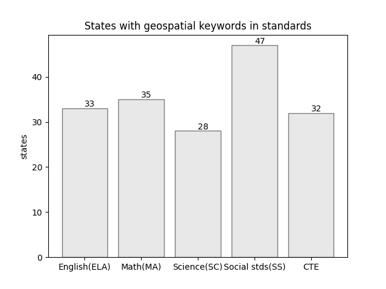
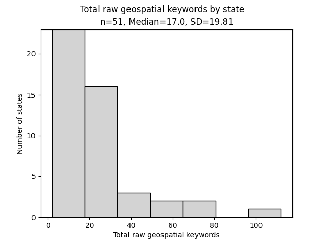

# Overview

### Background
This research uses iterative machine analyses to search for, record, and analyze
the presence of select geospatial keywords in US K12 curriculum standards, frameworks,
and programs of study. The state curriculum standards in English language arts (ELA), mathematics (MA), science (SC), social studies (SS), and Career Technical Education (CTE) as defined by each state, are accessed in their most recent version, decrypted, and saved to an archive prior to the machine analyses.

A modern, high-level programming language, Python 3.x was used to search the 3,500+ standards documents included in the study. The library PyPDF2 was used for reading documents. MySQL database was used to hold the retrieved data and samples. Python was also used to generate Markdown and HTML web pages based on content logged to the database. Python libraries Matplotlib and Numpy are used to generate the charts and graphcs.
The technical architecture used in this project is flexible, allowing for standards documents to be added or removed.  With the click of a few buttons all standards documents can be rescanned, committed to the database, analyzed, and published.  As multiple states update one or more standards documents annually, this capacity to completely recreate the analyses and reports is critical.  The algorithms and code are also flexible in that keywords may be added or removed.  Even geographical entities (e.g. US territories) could relatively easily added to the reporting.

### Findings
Fifty states' (and one district's) findings reports are generated and posted on this site, https://trbaker.github.com/GIStandards  These state reports each contain:
-	Total geospatial keywords found in five standards areas
-	A “comparable score” (basically the total geospatial keywords divided by all words in the standards)
-	A count of geospatial keywords (and comparable scores) by subject area
-	Link to the digital archive of the machine-readable standards
-	A reference to the document, page, and character position where keywords were found.  The keyword is also presented with a fixed number of words before and after it to provide context.

Each of five subject areas use the selected geospatial keywords in multiple states – ranging from approximately two dozen states with geospatial language in science standards to nearly four dozen states with geospatial language in the social studies standards.  Geospatial keywords were surprisingly robust in both math and English (ELA) although the vast majority can be attributed to the use of the word, “spatial”.

The keyword "spatial" accounts for about 50% of all keywords found.  While "spatial" is a general term, often used interchangeably with locational or geographical, it alone does not rise to the level of specificity of "geospatial", "GIS", or even "geographic analysis".  Use in various standards, "spatial" is often used with "temporal" (especially in science) to underscore the relevance of time and space in data.  For these reasons, it's worth reconsidering figure 1 with "spatial" removed from findings.

Figure 2 shows that "spatial" is the primary geospatial keyword in both English (ELA) and mathematics (MA).  In science, the Next Generation Science Standards (NGSS) refer to "spatial and temporal".  The shift from figure 1 to figure 2 in science indicates in large part, the number of states using the NGSS. The change in social studies was the real surprise, moving from 46 to 31 states - or about a 35% decline in states when "spatial" was removed from the geospatial keyword list.  Califnornia is one such example where "spatial thinking", "spatial contexts", and "spatial distribution" are present in the social studies standards but there is no geospatial language or technology in those standards.  It's a cautionary tale.

For the remainder of this analysis, "spatial" will remain in the keword list.

### Analyses
When plotting data on a histogram, it is apparent the total raw count of geospatial keywords by state is non-normal, producing a histogram that is right-skewed. Note the mean and nearly equal standard deviation.

_comparable score

Spatial distro by subjects and total
Using comparative score to describe the distribution.
Tests of significance?

### Conclusions
Aside from state curriculum standards, in the US, national subject area standards (along with cross-cutting standards like ISTE's technology standards) and district or local standards may all inform classroom activities to varying levels.  Assessments tied to standards, administrative oversight, and external factors (e.g. COVID-19) also all play roles on the impact of standards in classroom activites. Regardless, this research should help inform curriculum developers, educators, and researchers about the condition of geospatial language used in state standards - in part providing a way to view and measure the importance of geospatial tools in curriculum and society as gauged by the larger K-12 community.

### Bibliography

Jo, I., Duke, B. & Baker, T.R. (2019). Advance Your Geospatial Technology--Empowered by Your Curriculum Standards. NCSS 2019 Conference: Austin, TX. http://bit.ly/geospatialwords 

US Census. (2021). Cartographic Boundary Files - KML.  https://www.census.gov/geographies/mapping-files/time-series/geo/kml-cartographic-boundary-files.html

<!-- Global site tag (gtag.js) - Google Analytics -->

